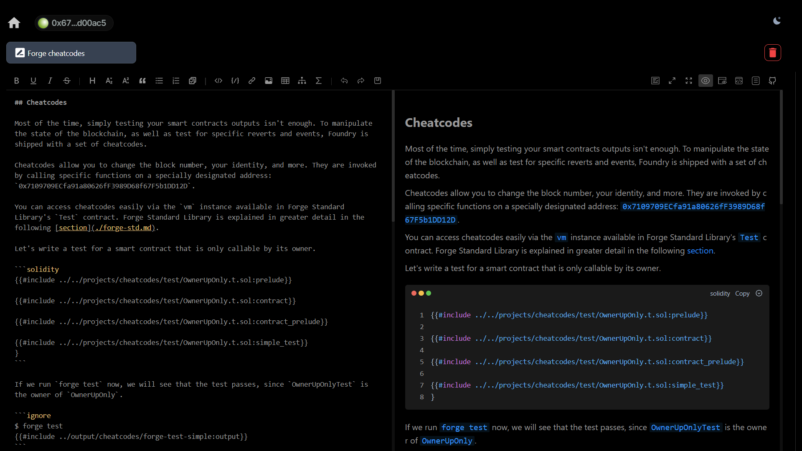

# eth_sign_diary

Write and secure your notes using your wallet. This app allows you to write and store markdown notes locally, secured through a combination of an Ethereum wallet signature and AES-GCM encryption. The idea behind this pet project is that it’s much easier to use an existing security provider(which is your wallet) rather than remembering a password or storing your notes in the cloud.



## Local installation

### Step 1: Clone the Repository

Open your terminal and run the following command:

```bash
git clone https://github.com/typicalHuman/eth_sign_diary
```

This will download the project files to a new folder with the repository name.

### Step 2: Navigate to the Project Directory

Move into the project directory with:

```bash
cd eth_sign_diary
```

### Step 3: Install Dependencies

In the project directory, install the dependencies using npm:

```bash
npm install
```

This will download all necessary packages listed in `package.json`.

### Step 4: Start the Development Server

To start the development server and run the project locally, use:

```bash
npm run dev
```

Vite will start a local development server (usually on `http://localhost:5173`). You should see this URL in the terminal output. Open it in your browser to view the project.

### Step 5: Build for Production (Optional)

If you need to build the project for production, run:

```bash
npm run build
```

This will create an optimized, production-ready version in the `dist` folder.

### Step 6: Preview the Production Build (Optional)

To preview the production build locally, you can use:

```bash
npm run preview
```

This will start a server to serve the production build for testing purposes.
